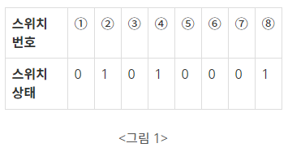
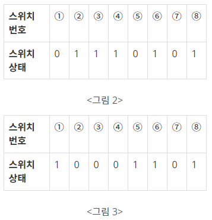

# 스위치 켜고끄기

## 문제

1부터 연속적으로 번호가 붙어있는 스위치들이 있다. 스위치는 켜져 있거나 꺼져있는 상태이다. <그림 1>에 스위치 8개의 상태가 표시되어 있다. ‘1’은 스위치가 켜져 있음을, ‘0’은 꺼져 있음을 나타낸다. 그리고 학생 몇 명을 뽑아서, 학생들에게 1 이상이고 스위치 개수 이하인 자연수를 하나씩 나누어주었다. 학생들은 자신의 성별과 받은 수에 따라 아래와 같은 방식으로 스위치를 조작하게 된다.

남학생은 스위치 번호가 자기가 받은 수의 배수이면, 그 스위치의 상태를 바꾼다. 즉, 스위치가 켜져 있으면 끄고, 꺼져 있으면 켠다. <그림 1>과 같은 상태에서 남학생이 3을 받았다면, 이 학생은 <그림 2>와 같이 3번, 6번 스위치의 상태를 바꾼다.

여학생은 자기가 받은 수와 같은 번호가 붙은 스위치를 중심으로 좌우가 대칭이면서 가장 많은 스위치를 포함하는 구간을 찾아서, 그 구간에 속한 스위치의 상태를 모두 바꾼다. 이때 구간에 속한 스위치 개수는 항상 홀수가 된다.



예를 들어 <그림 2>에서 여학생이 3을 받았다면, 3번 스위치를 중심으로 2번, 4번 스위치의 상태가 같고 1번, 5번 스위치의 상태가 같으므로, <그림 3>과 같이 1번부터 5번까지 스위치의 상태를 모두 바꾼다. 만약 <그림 2>에서 여학생이 4를 받았다면, 3번, 5번 스위치의 상태가 서로 다르므로 4번 스위치의 상태만 바꾼다.



입력으로 스위치들의 처음 상태가 주어지고, 각 학생의 성별과 받은 수가 주어진다. 학생들은 입력되는 순서대로 자기의 성별과 받은 수에 따라 스위치의 상태를 바꾸었을 때, 스위치들의 마지막 상태를 출력하는 프로그램을 작성하시오.

---

## 입력

첫째 줄에는 스위치 개수가 주어진다. 스위치 개수는 100 이하인 양의 정수이다. 둘째 줄에는 각 스위치의 상태가 주어진다. 켜져 있으면 1, 꺼져있으면 0이라고 표시하고 사이에 빈칸이 하나씩 있다. 셋째 줄에는 학생수가 주어진다. 학생수는 100 이하인 양의 정수이다. 넷째 줄부터 마지막 줄까지 한 줄에 한 학생의 성별, 학생이 받은 수가 주어진다. 남학생은 1로, 여학생은 2로 표시하고, 학생이 받은 수는 스위치 개수 이하인 양의 정수이다. 학생의 성별과 받은 수 사이에 빈칸이 하나씩 있다.

---

## 출력

스위치의 상태를 1번 스위치에서 시작하여 마지막 스위치까지 한 줄에 20개씩 출력한다. 예를 들어 21번 스위치가 있다면 이 스위치의 상태는 둘째 줄 맨 앞에 출력한다. 켜진 스위치는 1, 꺼진 스위치는 0으로 표시하고, 스위치 상태 사이에 빈칸을 하나씩 둔다.

---

### 내가 이해한 스위치 켜고끄기 정리

1. 남학생은 배수의 상태를 변경한다. 조건이 간단하기에 남학생부터 정리한다.
2. 여학생은 번호기준으로 최대 좌우 대칭을 찾아 모두 바꿔준다.

---

## 코드

[ **1차시도** ]

```python
# 스위치 수
switch_n = int(input())
# 스위치 상태
switch_arr = list(map(int,input().split()))
# 학생수
students_n = int(input())

for i in range(students_n):
    # 학생성별 , 학생이 받은 수
    F_or_M , num = map(int,input().split())
    
    # 성별이 남자일때, 받은 수의 배수를 변경
    if F_or_M == 1 :
        # change : 받은 번호의 배수자리
        for change in range(num,switch_n+1,num):
            # 1이면 0으로
            if switch_arr[change-1]:
                switch_arr[change-1]=0
            # 0이면 1으로
            else:
                switch_arr[change-1]=1
    # 성별이 여자일때, 번호 기준 최대로 긴 좌우대칭을 찾아 모두 변경
    else:
        change_arr = set([num-1])
        for j in range(switch_n//2):
            if (num+j<switch_n and num-j>0 and switch_arr[num+j-1] == switch_arr[num-j-1]):
                change_arr.add(num+j-1)
                change_arr.add(num-j-1)
            else:
                for change in change_arr:
                    # 1이면 0으로
                    if switch_arr[change]:
                        switch_arr[change]=0
                    # 0이면 1으로
                    else:
                        switch_arr[change]=1
                break
print(*switch_arr)
```

**1차시도 후기 : 문제에서 출력하라는대로 출력을 안했다.**

```python
# 스위치 수
switch_n = int(input())
# 스위치 상태
switch_arr = list(map(int,input().split()))
# 학생수
students_n = int(input())

for i in range(students_n):
    # 학생성별 , 학생이 받은 수
    F_or_M , num = map(int,input().split())
    
    # 성별이 남자일때, 받은 수의 배수를 변경
    if F_or_M == 1 :
        # change : 받은 번호의 배수자리
        for change in range(num,switch_n+1,num):
            # 1이면 0으로
            if switch_arr[change-1]:
                switch_arr[change-1]=0
            # 0이면 1으로
            else:
                switch_arr[change-1]=1
    # 성별이 여자일때, 번호 기준 최대로 긴 좌우대칭을 찾아 모두 변경
    else:
        i = 0
        while num+i-1< switch_n and num-i-1>=0:
            if switch_arr[num+i-1] == switch_arr[num-i-1]:
                if switch_arr[num+i-1] and switch_arr[num-i-1] :
                    switch_arr[num+i-1] = switch_arr[num-i-1] = 0
                else:
                    switch_arr[num+i-1] = switch_arr[num-i-1] = 1
                i += 1
            else:
                break

for i in range(0,switch_n,20):
    print(*switch_arr[i:i+20])
```

**2차시도 후기 : 문제에서 출력하라는 대로 출력하고 성별이 여자일때 조건의 코드를 변경해주었다. 이때 while문 조건에 `num+i-1< switch_n and num-i-1>=0` 범위가 중요하다. '='이 있고 없고에 따라 런타임에러가 날수도있다. **