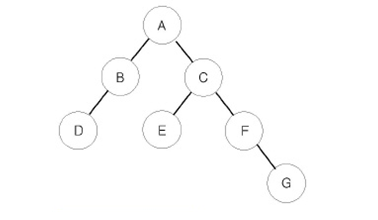

# 트리순회

## 문제

이진 트리를 입력받아 전위 순회(preorder traversal), 중위 순회(inorder traversal), 후위 순회(postorder traversal)한 결과를 출력하는 프로그램을 작성하시오.



예를 들어 위와 같은 이진 트리가 입력되면,

- 전위 순회한 결과 : ABDCEFG // (루트) (왼쪽 자식) (오른쪽 자식)
- 중위 순회한 결과 : DBAECFG // (왼쪽 자식) (루트) (오른쪽 자식)
- 후위 순회한 결과 : DBEGFCA // (왼쪽 자식) (오른쪽 자식) (루트)

가 된다.

## 입력

첫째 줄에는 이진 트리의 노드의 개수 N(1 ≤ N ≤ 26)이 주어진다. 둘째 줄부터 N개의 줄에 걸쳐 각 노드와 그의 왼쪽 자식 노드, 오른쪽 자식 노드가 주어진다. 노드의 이름은 A부터 차례대로 알파벳 대문자로 매겨지며, 항상 A가 루트 노드가 된다. 자식 노드가 없는 경우에는 .으로 표현한다.

## 출력

첫째 줄에 전위 순회, 둘째 줄에 중위 순회, 셋째 줄에 후위 순회한 결과를 출력한다. 각 줄에 N개의 알파벳을 공백 없이 출력하면 된다.

---

### 내가 이해한 트리순회 정리

1. 나동빈님의 트리 구현을 참고하였다.

## 코드

```python
class Node:
    def __init__(self,data,left_node,right_node):
        self.data = data
        self.left_node = left_node
        self.right_node = right_node

# 전위 순회(Preorder Traversal) : VLR
def pre_order(node):
    print(node.data, end='')
    if node.left_node != '.':
        pre_order(tree[node.left_node])
    if node.right_node != '.':
        pre_order(tree[node.right_node])
# 중위 순회(Inorder Traversal) : LVR
def in_order(node):
    if node.left_node != '.':
        in_order(tree[node.left_node])
    print(node.data, end='')
    if node.right_node != '.':
        in_order(tree[node.right_node])
# 후위 순회(Postorder Traversal) : LRV
def post_order(node):
    if node.left_node != '.':
        post_order(tree[node.left_node])
    if node.right_node != '.':
        post_order(tree[node.right_node])
    print(node.data, end='')

n = int(input())
tree = {}

for i in range(n):
    data, left_node, right_node = input().split()
    if left_node == ".":
        left_node = '.'
    if right_node == ".":
        right_node = '.'
    tree[data] = Node(data,left_node,right_node)

pre_order(tree['A'])
print()
in_order(tree['A'])
print()
post_order(tree['A'])
print()
```

