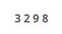

# 직사각형

## 문제

2차원 격자공간에 두 개의 꼭짓점 좌표로 표현되는 직사각형이 있다. 직사각형은 아래와 같이 왼쪽 아래 꼭짓점 좌표 (x, y)와 오른쪽 위 꼭짓점 좌표 (p, q)로 주어진다.


이 문제에서 모든 직사각형은 두 꼭짓점의 좌표를 나타내는 4개의 정수 x y p q 로 표현된다. 단 항상 x<p, y<q 이다. 예를 들어 위 그림에 제시된 직사각형이라면 아래와 같이 표현된다.



두 개의 직사각형은 그 겹치는 부분의 특성에 따라 다음 4가지 경우로 분류될 수 있다. 

먼저 두 직사각형의 겹치는 부분이 직사각형인 경우이다. 아래 그림(a)는 공통부분이 직사각형인 경우의 3가지 예를 보여준다,


또는 겹치는 부분이 아래 그림 (b)와 같이 선분이 될 수도 있고, 그림 (c)와 같이 점도 될 수 있다. 


마지막으로 아래 그림 (d)와 같이 공통부분 없이 두 직사각형이 완전히 분리된 경우도 있다.


여러분은 두 직사각형의 겹치는 부분이 직사각형인지, 선분인지, 점인지, 아니면 전혀 없는 지를 판별해서 해당되는 코드 문자를 출력해야 한다. 

| 공통부분의 특성 | 코드 문자 |
| --------------- | --------- |
| 직사각형        | a         |
| 선분            | b         |
| 점              | c         |
| 공통부분이 없음 | d         |

## 입력

4개의 줄로 이루어져 있다. 각 줄에는 8개의 정수가 하나의 공백을 두고 나타나는데, 첫 4개의 정수는 첫 번째 직사각형을, 나머지 4개의 정수는 두 번째 직사각형을 각각 나타낸다. 단 입력 직사각형의 좌표 값은 1이상 50,000 이하의 정수로 제한된다. 

## 출력

4개의 각 줄에 주어진 두 직사각형의 공통부분을 조사해서 해당하는 코드 문자를 출력파일의 첫 4개의 줄에 각각 차례대로 출력해야 한다.

```text
예제 입력
3 10 50 60 100 100 200 300
45 50 600 600 400 450 500 543
11 120 120 230 50 40 60 440
35 56 67 90 67 80 500 600
예제 출력
d
a
a
b
```

### 내가 이해한 직사각형 정리

1. 구역나누는게 중요할듯

## 코드

[ **1차시도** ]

```python
# 입력 순서 : 사각형 왼쪽 아래(x,y) , 사각형 오른쪽 위(p,q)

T = 4

for tc in range(1,T+1):
    x1,y1,p1,q1,x2,y2,p2,q2 = map(int,input().split())

    # 결과
    result = ''

    # 만나지 않는다. 
    if q1 < y2 or q2 < y1 or x1 > p2 or p1 < x2:
        result = 'd'
    # 점 & 선 (왽쪽 -> 오른쪽)
    elif p1 == x2:
        # 점
        if q1 == y2 or y1 == q2:
            result = 'c'
        else:
            result = 'b'
    elif x1 == p2:
        if y1 == q2 or q1 == y2:
            result = 'c'
        else:
            result = 'b'
    # 위 조건에서 다 통과하지 못하면 다 직사각형
    else:
        result = 'a'
    
    print(result)
```


[ **2차시도** ]

```python
# 입력 순서 : 사각형 왼쪽 아래(x,y) , 사각형 오른쪽 위(p,q)

T = 4

for i in range(T):
    x1,y1,p1,q1,x2,y2,p2,q2 = map(int,input().split())

    # 결과
    result = 'a'

    # 만나지 않는다. 
    if q1 < y2 or q2 < y1 or x1 > p2 or p1 < x2:
        result = 'd'
    # 점 & 선 (왼쪽 -> 오른쪽)
    if p1 == x2:
        # 점
        if q1 == y2 or y1 == q2:
            result = 'c'
        else:
            result = 'b'
    if x1 == p2:
        if y1 == q2 or q1 == y2:
            result = 'c'
        else:
            result = 'b'
    if q1 == y2:
        if p1 == x2 or p2 == x1:
            result = 'c'
        else:
            result = 'b'
    if q2 == y1:
        if p1 == x2 or p2 == x1:
            result = 'c'
        else:
            result = 'b'

    # 위 조건에서 다 통과하지 못하면 다 직사각형
    
    print(result)
```


[ **3차시도** ]

```python
T = 4

for i in range(T):
    x1,y1,p1,q1,x2,y2,p2,q2 = map(int,input().split())

    # 결과
    result = 'a'

    # 만나지 않는다. 
    if q1 < y2 or q2 < y1 or x1 > p2 or p1 < x2:
        result = 'd'
    else:
        # 점 & 선 (왼쪽 -> 오른쪽)
        if p1 == x2:
            # 점
            if q1 == y2 or y1 == q2:
                result = 'c'
            else:
                result = 'b'
        if x1 == p2:
            if y1 == q2 or q1 == y2:
                result = 'c'
            else:
                result = 'b'
        if q1 == y2:
            if p1 == x2 or p2 == x1:
                result = 'c'
            else:
                result = 'b'
        if q2 == y1:
            if p1 == x2 or p2 == x1:
                result = 'c'
            else:
                result = 'b'

    # 위 조건에서 다 통과하지 못하면 다 직사각형
    
    print(result)
```

