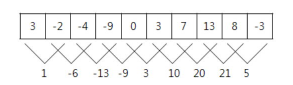
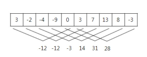

# 수열

## 문제

매일 아침 9시에 학교에서 측정한 온도가 어떤 정수의 수열로 주어졌을 때, 연속적인 며칠 동안의 온도의 합이 가장 큰 값을 알아보고자 한다.

예를 들어, 아래와 같이 10일 간의 온도가 주어졌을 때, 

3 -2 -4 -9 0 3 7 13 8 -3

모든 연속적인 이틀간의 온도의 합은 아래와 같다.



이때, 온도의 합이 가장 큰 값은 21이다. 

또 다른 예로 위와 같은 온도가 주어졌을 때, 모든 연속적인 5일 간의 온도의 합은 아래와 같으며, 



이때, 온도의 합이 가장 큰 값은 31이다.

매일 측정한 온도가 정수의 수열로 주어졌을 때, 연속적인 며칠 동안의 온도의 합이 가장 큰 값을 계산하는 프로그램을 작성하시오. 

---

## 입력

첫째 줄에는 두 개의 정수 N과 K가 한 개의 공백을 사이에 두고 순서대로 주어진다. 첫 번째 정수 N은 온도를 측정한 전체 날짜의 수이다. N은 2 이상 100,000 이하이다. 두 번째 정수 K는 합을 구하기 위한 연속적인 날짜의 수이다. K는 1과 N 사이의 정수이다. 둘째 줄에는 매일 측정한 온도를 나타내는 N개의 정수가 빈칸을 사이에 두고 주어진다. 이 수들은 모두 -100 이상 100 이하이다. 

---

## 출력

첫째 줄에는 입력되는 온도의 수열에서 연속적인 K일의 온도의 합이 최대가 되는 값을 출력한다.

---

### 내가 이해한 수열 정리

1. 초등학생 올림피아드 문제이다.
2. 입력된 값을 원하는 날짜만큼 더하고 그중 가장 큰 값을 찾으면된다

---

## 코드

[ **1차 시도** ]

```python
#연습코드
import sys
input = sys.stdin.readline

day , sum_day = map(int,input().split()) # => 문제에서 N,K를 스스로 알아보기 쉽게 day,sum_day로 받음

temps = [] # => 빈리스트를 만들어서 연속적인 며칠의 값을 받을 준비를함
input_i = 1
while input_i <= day:
    day_temp = int(input()) # => 시작값을 1로 주면서 총 day만큼 값을 입력하게함
    temps.append(day_temp) # => 입력한 값을 리스트에 넣어줌
    input_i += 1

i = 0
sum_temp = [] # => 연속적인 며칠의 값을 원하는 날짜만큼 더한 값을 넣을 빈리스트를 생성함
while i <= (day-sum_day):
    sum_temp.append(sum(temps[i:i+sum_day])) # => 원하는 기간만큼 뽑아주고 그 값들을 더한후 생성해둔 리스트에 넣어준다.
    i += 1
print(max(sum_temp))
```

**1차시도 후기 : 처음에 예제 입력을 제대로 확인 안하고 연속적인 며칠의 값을 하나 하나 입력받는 코드로 작성했다. 그 결과 `런타임에러(Value error)`를 마주했다.**


[ **2차시도** ]

```python
#연습코드
import sys
input = sys.stdin.readline

day , sum_day = map(int,input().split())

temps = list(map(int,input().split())) # => 예제입력처럼 한줄로 받고 나누어서 리스트에 넣었다.

sum_temp = [] # => 원하는 기간만큼 계산한 값을 넣는 빈리스트를 생성한다.
for i in range(day-sum_day+1):
    sum_temp.append(sum(temps[i:i+sum_day]))
print(max(sum_temp))
```

**2차시도 후기 : 너무 쉽게 풀었다. 1차시도에서 잘못 본 부분만 수정하면 되는 줄 알았지만 `시간초과`라는 결과를 받았다. 입력되는과정에서 생긴 시간초과가 아닌것같다. 위 코드중 반복하여 값을 더하는 과정에서 계속 새로 불러와 계산하기때문에 생기는 시간초과인것 같다.**


[ **3차시도** ]

```python
#정답코드

day , sum_day = map(int,input().split())

temps = list(map(int,input().split()))

temp_sum_day_list = [sum(temps[:sum_day])] # => 미리 처음을 계산해서 새로운 리스트를 만들어준다.

for i in range(1,day-sum_day+1): # => 처음은 만들어 놨으니 그다음부터 계산 할 수 있도록 범위를 설정한다.
    sum_temp = temp_sum_day_list[-1]+temps[i+sum_day-1] - temps[i-1] # => 해당 코드의 설명은 아래에서 따로 다루겠음
    temp_sum_day_list.append(sum_temp)
print(max(temp_sum_day_list))
```

**3차시도 후기 : 2차시도 후 약 3일동안 여러방법을 통해 시도해봤지만 내가 원하는 코드를 만들어 내는 것에 한계를 마주했다. 그래서 구글링을 해본결과 내가 구현하고 싶었던 코드를 찾게 되었다.**

---

### 3차시도 코드 설명

입력예제

[10 2
3 -2 -4 -9 0 3 7 13 8 -3]

---

위와 같은 예제가 입력될 때,

이미 `temp_sum_day_list`에는 `temp[:2]`의 합이 리스트 형태로 생성되어있다.

이후 반복문에서

`sum_temp = temp_sum_day_list[-1]+temps[i+sum_day-1] - temps[i-1]` 

해당 코드를 통해 값이 계속 생성되는데 

[ **제일 처음의 반복문의 값** ]

- temp_sum_day_list[-1] : -1
- temps[i+sum_day-1] :  => temps[1+2-1] => temps[2] => -4
- temps[i-1] : temps[1-1] => temps[0] => 3

즉, 더한 값을 temp_sum_day_list에 넣어두고 해당 리스트의 마지막 값에서 다음 날의 온도를 더하고 그전에 더해진 값 중 제일 첫번째 값을 빼주는 방법이다.

해당 코드를 통해 계속해서 값을 불러와 계산하는 방법보다 더 짧은 시간이 든다.

