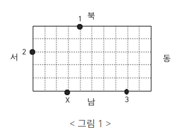

# 경비원

## 문제

동근이는 무인 경비 회사 경비원으로 항상 대기하고 있다가 호출이 들어오면 경비차를 몰고 그 곳으로 달려가야 한다. 동근이가 담당하고 있는 곳은 직사각형 모양의 블록으로 블록 중간을 가로질러 차가 통과할만한 길이 없다. 이 블록 경계에 무인 경비를 의뢰한 상점들이 있다.

예를 들어 가로의 길이가 10, 세로의 길이가 5인 블록의 경계에 무인 경비를 의뢰한 3개의 상점이 있다고 하자. <그림 1>과 같이 이들은 1, 2, 3으로 표시되어 있고, 동근이는 X로 표시한 위치에 있다.



1번 상점에서 호출이 들어 왔을 때 동근이가 블록을 시계방향으로 돌아 이동하면 이동 거리가 12가 된다. 반면 반시계방향으로 돌아 이동하면 이동 거리는 18이 된다. 따라서 동근이가 1번 상점으로 가는 최단 거리는 12가 된다. 마찬가지로 동근이의 위치에서 2번 상점까지의 최단 거리는 6, 3번 상점까지의 최단 거리는 5가 된다.

블록의 크기와 상점의 개수 및 위치 그리고 동근이의 위치가 주어질 때 동근이의 위치와 각 상점 사이의 최단 거리의 합을 구하는 프로그램을 작성하시오.

---

## 입력

첫째 줄에 블록의 가로의 길이와 세로의 길이가 차례로 주어진다. 둘째 줄에 상점의 개수가 주어진다. 블록의 가로의 길이와 세로의 길이, 상점의 개수는 모두 100이하의 자연수이다. 이어 한 줄에 하나씩 상점의 위치가 주어진다. 상점의 위치는 두 개의 자연수로 표시된다. 첫째 수는 상점이 위치한 방향을 나타내는데, 1은 블록의 북쪽, 2는 블록의 남쪽, 3은 블록의 서쪽, 4는 블록의 동쪽에 상점이 있음을 의미한다. 둘째 수는 상점이 블록의 북쪽 또는 남쪽에 위치한 경우 블록의 왼쪽 경계로부터의 거리를 나타내고, 상점이 블록의 동쪽 또는 서쪽에 위치한 경우 블록의 위쪽 경계로부터의 거리를 나타낸다. 마지막 줄에는 동근이의 위치가 상점의 위치와 같은 방식으로 주어진다. 상점의 위치나 동근이의 위치는 블록의 꼭짓점이 될 수 없다.

---

## 출력

첫째 줄에 동근이의 위치와 각 상점 사이의 최단 거리의 합을 출력한다.

```text
예제입력
10 5
3
1 4
3 2
2 8
2 3
예제출력
23
```

---

### 내가 이해한 경비원 정리

1. 1 - 북 / 2 - 남 / 3 - 서 / 4 - 동
2. 북과 남은 왼쪽 기준 / 동과 서는 위쪽기준
3. 최단거리를 계산한다.
4. 통과할수 없다.

---

## 코드

[ **1차시도** ]

```python
#가로,세로 입력
garo , sero = map(int,input().split())
#가게 수
N = int(input())

#최소거리 구하는 함수
#x1 : 가게방향 y1 : 위치 x2 : 동근이방향 y2 : 동근이 위치
def min_distance(x1,y1,x2,y2):
    if x1 == 1: #가게 방향 북쪽
        if x2 == 1: #동근이 방향 북쪽
            return abs(y1-y2) #같은 위치에 있으므로 절대값 거리반환
        elif x2 == 2: #동빙남
            return min((y2+sero+y1),(garo-y2+sero+garo-y1)) #시계방향,반시계방향은 최소값 반환
        elif x2 == 3 : #동방서
            return min((y2+y1),(sero-y2+garo+sero+garo-y1))
        elif x2 == 4 : #동방동
            return min((sero-y2+garo+sero+y1),(y2+garo-y1))
    elif x1 == 2: #가방남
        if x2 == 1: 
            return min((garo-y2+sero+garo-y1),(y2+sero+y1)) #시계방향,반시계방향은 최소값 반환
        elif x2 == 2: 
            return abs(y1-y2) #같은 방향에 있으므로 절대값 거리반환
        elif x2 == 3 : 
            return min((y2+garo+sero+garo-y1),(sero-y2+y1))
        elif x2 == 4 : 
            return min((sero-y2+garo-y1),(y2+garo+sero+y1))
    elif x1 == 3: #가방서
        if x2 == 1: 
            return min((garo-y2+sero+garo+sero-y1),(y2+y1))
        elif x2 == 2: 
            return min((y2+sero-y1),(garo-y2+sero+garo+y1)) #시계방향,반시계방향은 최소값 반환
        elif x2 == 3 : 
            return abs(y1-y2) #같은 방향에 있으므로 절대값 거리반환
        elif x2 == 4 : 
            return min((sero-y2+garo+sero-y1),(y2+garo+y1))
    elif x1 == 4: #가위동
        if x2 == 1: 
            return min((garo-y2+y1),(y2+sero+garo+sero-y1))
        elif x2 == 2: 
            return min((y2+sero+garo+y1),(garo-y2+sero-y1)) #시계방향,반시계방향은 최소값 반환
        elif x2 == 3 : 
            return min((y2+garo+y1),(sero-y2+garo+sero-y1))
        elif x2 == 4 : 
            return abs(y1-y2) #같은 방향에 있으므로 절대값 거리반환

store_arr = []
#가게방향/위치
for i in range(N):
    x1 , y1 = map(int,input().split())
    store_arr.append([x1,y1])

#동근이방향/위치
x2 , y2 = map(int,input().split())

#최단거리 합
result = 0
for i in store_arr:
    result += min_distance(i[0],i[1],x2,y2)

print(result)
```

**1차시도 후기 :  와 이거 너무 더럽다,,ㅋㅋㅋㅋㅋㅋㅋㅋ 진짜 역대급으로 더럽다. 심지어 중복되는값 내가 헷갈릴까봐 `*2` 이런식으로 안바꾸고 그냥 다 써놨더니 통과는 됐는데 미친듯이 더럽닼ㅋㅋㅋㅋㅋㅋㅋㅋㅋ 과연 이것을 알고리즘을 배운 사람의 코딩이라고 할 수 있는가,,;;**