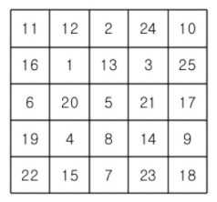
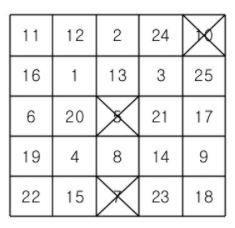
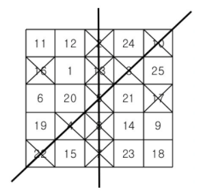
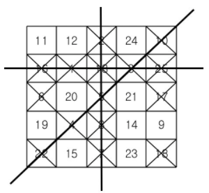

# 빙고

## 문제

빙고 게임은 다음과 같은 방식으로 이루어진다.

먼저 아래와 같이 25개의 칸으로 이루어진 빙고판에 1부터 25까지 자연수를 한 칸에 하나씩 쓴다



다음은 사회자가 부르는 수를 차례로 지워나간다. 예를 들어 5, 10, 7이 불렸다면 이 세 수를 지운 뒤 빙고판의 모습은 다음과 같다.



차례로 수를 지워가다가 같은 가로줄, 세로줄 또는 대각선 위에 있는 5개의 모든 수가 지워지는 경우 그 줄에 선을 긋는다.



이러한 선이 세 개 이상 그어지는 순간 "빙고"라고 외치는데, 가장 먼저 외치는 사람이 게임의 승자가 된다.



철수는 친구들과 빙고 게임을 하고 있다. 철수가 빙고판에 쓴 수들과 사회자가 부르는 수의 순서가 주어질 때, 사회자가 몇 번째 수를 부른 후 철수가 "빙고"를 외치게 되는지를 출력하는 프로그램을 작성하시오.

---

## 입력

첫째 줄부터 다섯째 줄까지 빙고판에 쓰여진 수가 가장 위 가로줄부터 차례대로 한 줄에 다섯 개씩 빈 칸을 사이에 두고 주어진다. 여섯째 줄부터 열째 줄까지 사회자가 부르는 수가 차례대로 한 줄에 다섯 개씩 빈 칸을 사이에 두고 주어진다. 빙고판에 쓰여진 수와 사회자가 부르는 수는 각각 1부터 25까지의 수가 한 번씩 사용된다.

---

## 출력

첫째 줄에 사회자가 몇 번째 수를 부른 후 철수가 "빙고"를 외치게 되는지 출력한다.

---

```text
예제 입력
11 12 2 24 10
16 1 13 3 25
6 20 5 21 17
19 4 8 14 9
22 15 7 23 18
5 10 7 16 2
4 22 8 17 13
3 18 1 6 25
12 19 23 14 21
11 24 9 20 15
예제 출력
15
```

---

### 내가 이해한 빙고 정리

1. 처음 5줄은 빙고게임판이고 그 다음 5줄은 사회자가 부르는 번호순서이다.
1. 빙고게임판을 2차배열로 받아 사회자가 부르는 번호를 지워야한다.
1. 빙고를 외치는 순간이 몇번째인지 찾아야 하는 문제이다.

---

## 코드

[ **1차시도** ]

```python
# 빙고게임판(2차배열로 받음)
bingo_game = [list(map(int,input().split())) for _ in range(5)]
# 사회자가 부르는 번호 순서(2차배열로 받음)
bingo_X = [list(map(int,input().split())) for _ in range(5)]
# 사회작 부르는 번호 순서가 2차배열이면 생각하기 복잡해져서 1차배열로 다시 만들어줌
call_X = sum(bingo_X , [])

# 사회자가 번호를 부른 횟수
call_cnt = 0

# call : 사회자가 부른 번호
for call in call_X:
    # 빙고에 그은 선의 수
    line_cnt = 0
    
    # 1. 사회자가 부른 call이 있는 위치를 찾아서 0으로 바꾸기
    for i in range(5):
        for j in range(5):
            if bingo_game[i][j] == call:
                bingo_game[i][j] = 0
            else:pass
    # 2. 가로줄이 지워졌는지 확인
    for i in range(5):
        row_sum = 0
        for j in range(5):
            row_sum += bingo_game[i][j]
        if row_sum == 0 :
            line_cnt += 1
    # 3. 세로줄이 지워졌는지 확인
    for i in range(5):
        col_sum = 0
        for j in range(5):
            col_sum += bingo_game[j][i]
        if col_sum == 0 :
            line_cnt += 1
    # 4. 대각선이 지워졌는지 확인
    dae1_sum = 0
    for i in range(5):
        dae1_sum += bingo_game[i][i]
    if dae1_sum == 0 :
        line_cnt += 1
    dae2_sum = 0
    for i in range(5):
        dae2_sum += bingo_game[i][-i-1]
    if dae2_sum == 0 :
        line_cnt += 1
    call_cnt += 1
    
    # 위에서부터 조건에 맞는 경우 line_cnt에 +1하여 그어진 줄이 3줄이상이 되면 더이상 사회자가 부른 번호 순서를 찾을 필요가 없다. 그래서 break를 통해 탈출한다.
    if line_cnt >= 3:
        print(call_cnt)
        break
```

**1차시도 후기 : `line_cnt=0`을 선언하는 위치와 선을 긋기 위해 가로,세로,대각서을 각각 확인하는게 내 코드에 핵심이다. 처음에는 코드를 간략하게 짜보려고 한 for문안에서 가로,세로,대각선을 다 비교하려고 했었다. 그렇게 코드를 짜니 훨씬 보기 어렵고 복잡하기도 하고 헷갈려서 내가 내 코드를 읽지 못했다. 이보다 더 쉽게 푸는 방법은 아직 생각해 내지 못했다. 근데 읽기 쉬운 코드인것 같아 만족한다.**
