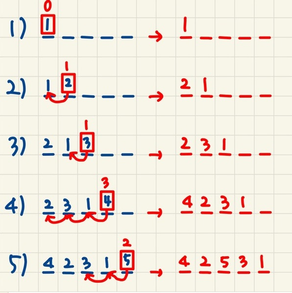

# 줄세우기

## 문제

점심시간이 되면 반 학생 모두가 한 줄로 줄을 서서 급식을 탄다. 그런데 매일 같이 앞자리에 앉은 학생들이 앞에 줄을 서 먼저 점심을 먹고, 뒷자리에 앉은 학생들은 뒤에 줄을 서 늦게 점심을 먹게 된다. 어떻게 하면 이러한 상황을 바꾸어 볼 수 있을까 고민하던 중 선생님이 한 가지 방법을 내 놓았다. 그 방법은 다음과 같다.

학생들이 한 줄로 줄을 선 후, 첫 번째 학생부터 차례로 번호를 뽑는다. 첫 번째로 줄을 선 학생은 무조건 0번 번호를 받아 제일 앞에 줄을 선다. 두 번째로 줄을 선 학생은 0번 또는 1번 둘 중 하나의 번호를 뽑는다. 0번을 뽑으면 그 자리에 그대로 있고, 1번을 뽑으면 바로 앞의 학생 앞으로 가서 줄을 선다. 세 번째로 줄을 선 학생은 0, 1 또는 2 중 하나의 번호를 뽑는다. 그리고 뽑은 번호만큼 앞자리로 가서 줄을 선다. 마지막에 줄을 선 학생까지 이와 같은 방식으로 뽑은 번호만큼 앞으로 가서 줄을 서게 된다. 각자 뽑은 번호는 자신이 처음에 선 순서보다는 작은 수이다.

예를 들어 5명의 학생이 줄을 서고, 첫 번째로 줄을 선 학생부터 다섯 번째로 줄을 선 학생까지 차례로 0, 1, 1, 3, 2번의 번호를 뽑았다고 하자, 첫 번째 학생부터 다섯 번째 학생까지 1부터 5로 표시하면 학생들이 줄을 선 순서는 다음과 같이 된다.

- 첫 번째 학생이 번호를 뽑은 후 : 1
- 두 번째 학생이 번호를 뽑은 후 : 2 1
- 세 번째 학생이 번호를 뽑은 후 : 2 3 1
- 네 번째 학생이 번호를 뽑은 후 : 4 2 3 1
- 다섯 번째 학생이 번호를 뽑은 후 : 4 2 5 3 1

따라서 최종적으로 학생들이 줄을 선 순서는 4, 2, 5, 3, 1이 된다.

줄을 선 학생들이 차례로 뽑은 번호가 주어질 때 학생들이 최종적으로 줄을 선 순서를 출력하는 프로그램을 작성하시오.

---

## 입력

첫째 줄에는 학생의 수가 주어지고 둘째 줄에는 줄을 선 차례대로 학생들이 뽑은 번호가 주어진다. 학생의 수가 100 이하이고, 학생들이 뽑는 번호는 0 또는 자연수이며 학생들이 뽑은 번호 사이에는 빈 칸이 하나씩 있다.

---

## 출력

학생들이 처음에 줄을 선 순서대로 1번부터 번호를 매길 때, 첫째 줄에 학생들이 최종적으로 줄을 선 순서를 그 번호로 출력한다. 학생 번호 사이에는 한 칸의 공백을 출력한다.

---

### 내가 이해한 수열 정리

1. 

   말보단 그림으로 이해하는게 편해서 직접 순서도를 그려봤다.

2. **뒷 순서의 자리가 바뀌면 앞사람은 계속 뒤로 밀려난다.** 즉 여기서 어떤 선택으로 코드를 작성하는가에 따라 방법이 달라진다.
   1. 학생 수에 맞는 번호가 담긴 리스트를 통해 계속해서 자리를 뽑아 리스트 값을 변경한다.
   2. 빈리스트에 바로 원하는 자리에 값을 넣어준다.

---

## 코드

[ **1차시도** ]

```python
#연습코드
students = int(input()) # => 학생의 수

random_num = list(map(int,input().split())) # => 학생들이 뽑은 번호

student_num = list(range(1,students+1)) # => 학생의 수에 맞는 번호리스트 ex) [1,2,3,4,5]

# 해당 반복문에 대한 설명은 아래에서 따로 다루겠음
for i in student_num:
    if random_num[i-1] > 0:
        student_num[i-1] = student_num[i-(random_num[i-1])-1]
        student_num[i-(random_num[i-1])-1] = i
        
print(student_num) # => [4, 3, 5, 2, 1]
```

**1차시도 후기 : 제일 처음 생각한 방법이다. 이 방법을 3번까지 손으로 적어보고 될 거 같길래 돌려봤는데 다른 결과 값이 나왔다. 어디가 문제인지 몰라서 끝까지 다 손으로 써봤다. 그 결과 4에서 2가 밀리는 것이 아니라 그냥 2와 자리를 바꿔버리는 문제가 발생한다. 당연하다. 그냥 자리를 바꾸게 코드를 짰으니깐ㅋㅋㅋㅋㅋㅋ 심지어 출력하는 방법도 신경안쓰고 했다. 암튼 덕분에 어떤 식으로 코드를 바꿔야할지 방법은 찾았다.**

---

### 1차시도 코드 설명

입력예제

[5

0 1 1 3 2]

---

위와 같은 예제가 입력될 때,

`random_num`에 [0,1,1,3,2]가 있고 `student_num`에 [1,2,3,4,5]가 생성된다.

여기서 먼저 `student_num`의 값을 하나씩 가져온다. 이 값이 `i` 이다.

그 다음 `random_num[i-1]`을 통해 `random_num`의 값도 하나씩 가져와 0과 비교한다.

이때,  `random_num[i-1]`의 값이  0보다 클 경우

