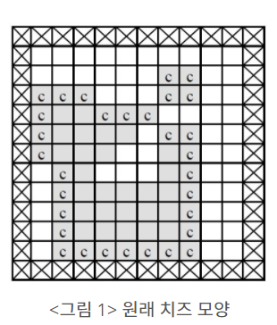
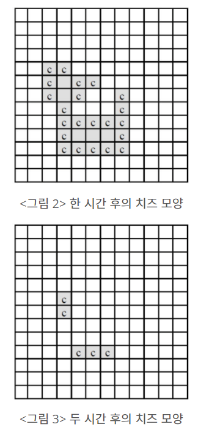

# 치즈

## 문제

아래 <그림 1>과 같이 정사각형 칸들로 이루어진 사각형 모양의 판이 있고, 그 위에 얇은 치즈(회색으로 표시된 부분)가 놓여 있다. 판의 가장자리(<그림 1>에서 네모 칸에 X친 부분)에는 치즈가 놓여 있지 않으며 치즈에는 하나 이상의 구멍이 있을 수 있다.

이 치즈를 공기 중에 놓으면 녹게 되는데 공기와 접촉된 칸은 한 시간이 지나면 녹아 없어진다. 치즈의 구멍 속에는 공기가 없지만 구멍을 둘러싼 치즈가 녹아서 구멍이 열리면 구멍 속으로 공기가 들어가게 된다. <그림 1>의 경우, 치즈의 구멍을 둘러싼 치즈는 녹지 않고 ‘c’로 표시된 부분만 한 시간 후에 녹아 없어져서 <그림 2>와 같이 된다.



다시 한 시간 후에는 <그림 2>에서 ‘c’로 표시된 부분이 녹아 없어져서 <그림 3>과 같이 된다.



<그림 3>은 원래 치즈의 두 시간 후 모양을 나타내고 있으며, 남은 조각들은 한 시간이 더 지나면 모두 녹아 없어진다. 그러므로 처음 치즈가 모두 녹아 없어지는 데는 세 시간이 걸린다. <그림 3>과 같이 치즈가 녹는 과정에서 여러 조각으로 나누어 질 수도 있다.

입력으로 사각형 모양의 판의 크기와 한 조각의 치즈가 판 위에 주어졌을 때, 공기 중에서 치즈가 모두 녹아 없어지는 데 걸리는 시간과 모두 녹기 한 시간 전에 남아있는 치즈조각이 놓여 있는 칸의 개수를 구하는 프로그램을 작성하시오.

## 입력

첫째 줄에는 사각형 모양 판의 세로와 가로의 길이가 양의 정수로 주어진다. 세로와 가로의 길이는 최대 100이다. 판의 각 가로줄의 모양이 윗 줄부터 차례로 둘째 줄부터 마지막 줄까지 주어진다. 치즈가 없는 칸은 0, 치즈가 있는 칸은 1로 주어지며 각 숫자 사이에는 빈칸이 하나씩 있다.

## 출력

첫째 줄에는 치즈가 모두 녹아서 없어지는 데 걸리는 시간을 출력하고, 둘째 줄에는 모두 녹기 한 시간 전에 남아있는 치즈조각이 놓여 있는 칸의 개수를 출력한다.

---

### 내가 이해한 치즈 정리

1. 0이 치즈 안에도 있다. 공기를 표현하는 0만 찾아서 공기와 맡다아있는 치즈를 찾아야한다.
2. 0을 기준으로 상하좌우를 살펴본다.
3. 이때, 0인 좌표는 살펴볼 좌표에 추가하고 1인 곳은 치즈를 녹여준다.
4. 위 과정을 치즈가 다 없어질때까지 반복한다.

---

## 코드

```python
from collections import deque
'''
0을 기준으로 치즈를 찾아야됨
1. 0에서 상하좌우를 살펴 0인 좌표는 deque에 넣고 1인 좌표는 공기와 맡다은 치즈이므로 lose_cheese에 넣는다.
2. 더이상 방분할 곳이 없으면 공기와 맡다은 치즈를 0으로 바꿔주고 방문기록을 초기화한다.
'''
def bfs(i,j):
    # 방문 기록
    visited = [[0]*galo for _ in range(selo)]
    # 0인 좌표 모을 덱큐
    zero_q = deque([])
    # 입력받은 i,j로 탐색 시작좌표 생성
    zero_q.append([i,j])
    # 방문기록 남기기
    visited[i][j] = 1

    # 델타
    di=[0,1,0,-1]
    dj=[1,0,-1,0]

    while zero_q:
        y,x = zero_q.popleft()
        for i in range(4):
            dy = y + di[i]
            dx = x + dj[i]
            if 0<=dy<selo and 0<=dx<galo:
                # 방문기록이 없는 곳 중에
                if not visited[dy][dx]:
                    # 치즈이면
                    if cheese[dy][dx]:
                        # 녹여주고 방문기록을 남긴다.
                        cheese[dy][dx] = 0
                        visited[dy][dx] = 1
                    # 치즈가 아니면
                    else : 
                        # 방문기록을 남기고 0인 좌표를 모으는 곳에 좌표를 넣어준다.
                        visited[dy][dx] = 1
                        zero_q.append([dy,dx])

selo,galo = map(int,input().split())
cheese = [list(map(int,input().split())) for _ in range(selo)]

# 만들어둔 bfs함수를 치즈가 다 녹을때까지 실행한다.
time = 0
last_cheese = 0
for _ in range(selo*galo):
    # cheese의 수를 계산함.
    cheese_cnt = 0
    for i in cheese:
        cheese_cnt += sum(i)
    
    # cheese가 다 녹으면 멈춘다.
    if not cheese_cnt:
        break

    else:
        bfs(0,0)
        time += 1
        last_cheese = cheese_cnt

print(time)
print(last_cheese)
```

