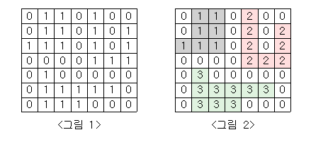

# 백준 2667 단지 번호 붙이기

## 문제

<그림 1>과 같이 정사각형 모양의 지도가 있다. 1은 집이 있는 곳을, 0은 집이 없는 곳을 나타낸다. 철수는 이 지도를 가지고 연결된 집의 모임인 단지를 정의하고, 단지에 번호를 붙이려 한다. 여기서 연결되었다는 것은 어떤 집이 좌우, 혹은 아래위로 다른 집이 있는 경우를 말한다. 대각선상에 집이 있는 경우는 연결된 것이 아니다. <그림 2>는 <그림 1>을 단지별로 번호를 붙인 것이다. 지도를 입력하여 단지수를 출력하고, 각 단지에 속하는 집의 수를 오름차순으로 정렬하여 출력하는 프로그램을 작성하시오.



## 입력

첫 번째 줄에는 지도의 크기 N(정사각형이므로 가로와 세로의 크기는 같으며 5≤N≤25)이 입력되고, 그 다음 N줄에는 각각 N개의 자료(0혹은 1)가 입력된다.

## 출력

첫 번째 줄에는 총 단지수를 출력하시오. 그리고 각 단지내 집의 수를 오름차순으로 정렬하여 한 줄에 하나씩 출력하시오.

---

### 내가 이해한 단지 번호 붙이기 정리

1. 단지 수를 세는 카운트와 단지 내의 집의 수를 세는 카운트를 만듬
2. 처음 생각은 새로운 배열에 단지 내의 집의 수를 넣는 걸로 생각함 -> 틀렸음 반례있음
3. 고쳐서 생각한게 그냥 단지 번호를 넣고 해당하는 단지 번호를 카운트하면 편함

---

## 코드

**[ 1차시도 ]**

```python
from collections import deque
def bfs(y,x):
    q = deque()
    q.append([y,x])

    di,dj = [0,1,0,-1],[1,0,-1,0]
    cnt = 0
    while q:
        Y,X = q.popleft()
        for i in range(4):
            dy = Y + di[i]
            dx = X + dj[i]
            if 0>dy or N<=dy or 0>dx or N<=dx or not arr[dy][dx]:
                continue

            cnt += 1
            dangi[dy][dx] = cnt
            q.append([dy,dx])
            arr[dy][dx] = 0
    
    dangi_h.append(cnt)

# -----------------------------------------------------------

N =  int(input())

arr = [list(map(int,input())) for _ in range(N)]
dangi = [[0]*N for _ in range(N)]

# 각 단지에 속하는 집의 수 리스트
dangi_h = []

# 총단지수
dangi_num = 0
for i in range(N):
    for j in range(N):
        if arr[i][j] :
            dangi_num += 1
            bfs(i,j)

# 출력
print(dangi_num)

dangi_h.sort(reverse=False)
for i in dangi_h:
    print(i)
```

해당 코드에 대한 반례

```text
5
11000
00000
00111
00000
10000

정답
3
1
2
3

코드 출력
3
0
2
3
```


**[ 2차시도 ]**

```python
from collections import deque
def bfs(y,x):
    q = deque()
    q.append([y,x])

    di,dj = [0,1,0,-1],[1,0,-1,0]
    while q:
        Y,X = q.popleft()
        for i in range(4):
            dy = Y + di[i]
            dx = X + dj[i]
            if 0>dy or N<=dy or 0>dx or N<=dx or not arr[dy][dx]:
                continue

            dangi[dy][dx] = dangi_num
            q.append([dy,dx])
            arr[dy][dx] = 0

    cnt = 0
    for i in dangi:
        cnt += i.count(dangi_num)
    
    dangi_h.append(cnt)

# -----------------------------------------------------------

N =  int(input())

arr = [list(map(int,input())) for _ in range(N)]
dangi = [[0]*N for _ in range(N)]

# 각 단지에 속하는 집의 수 리스트
dangi_h = []

# 총단지수
dangi_num = 0
for i in range(N):
    for j in range(N):
        if arr[i][j] :
            dangi_num += 1
            dangi[i][j] = dangi_num
            bfs(i,j)

# 출력
print(dangi_num)
dangi_h.sort(reverse=False)
for i in dangi_h:
    print(i)
```

