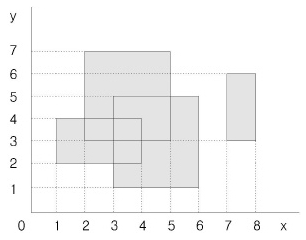

# 직사각형 네개의 합집합의 면적 구하기

## 문제

평면에 네 개의 직사각형이 놓여 있는데 그 밑변은 모두 가로축에 평행하다. 이 네 개의 직사각형들은 서로 떨어져 있을 수도 있고, 겹쳐 있을 수도 있고, 하나가 다른 하나를 포함할 수도 있으며, 변이나 꼭짓점이 겹칠 수도 있다.

이 직사각형들이 차지하는 면적을 구하는 프로그램을 작성하시오.



---

## 입력

입력은 네 줄이며, 각 줄은 직사각형의 위치를 나타내는 네 개의 정수로 주어진다. 첫 번째와 두 번째의 정수는 사각형의 왼쪽 아래 꼭짓점의 x좌표, y좌표이고 세 번째와 네 번째의 정수는 사각형의 오른쪽 위 꼭짓점의 x좌표, y좌표이다. 모든 x좌표와 y좌표는 1이상이고 100이하인 정수이다.

---

## 출력

첫 줄에 네개의 직사각형이 차지하는 면적을 출력한다.

---

### 내가 이해한 직사각형 면적구하기

1. 겹치는 부분을 제외하고 총 면적만 계산한다.

---

## 코드

[ **1차시도** ]

```python
# 직사각형의 수
box_n = 4
arr = [[0]*101 for _ in range(101)]

box_cnt = 0

for box in range(box_n):
    # 입력순서가 사각형의 왼쪽 아래 x,y 오른쪽위 x,y
    x1,y1,x2,y2 = map(int,input().split())
    # x의 범위를 x1부터 x2+1까지 하지 않고 x2까지 한다.
    # 사각형의 넓이를 구할때 (x2-x1)(y2-y1)으로 넓이를 구하는 것과 유사하다.
    for x in range(x1,x2):
        for y in range(y1,y2):
            if not arr[x][y] :
                arr[x][y] = 1
                box_cnt += 1

print(box_cnt)
```

