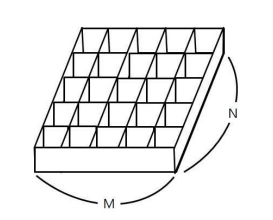

# 토마토

## 문제

철수의 토마토 농장에서는 토마토를 보관하는 큰 창고를 가지고 있다. 토마토는 아래의 그림과 같이 격자 모양 상자의 칸에 하나씩 넣어서 창고에 보관한다.



창고에 보관되는 토마토들 중에는 잘 익은 것도 있지만, 아직 익지 않은 토마토들도 있을 수 있다. 보관 후 하루가 지나면, 익은 토마토들의 인접한 곳에 있는 익지 않은 토마토들은 익은 토마토의 영향을 받아 익게 된다. 하나의 토마토의 인접한 곳은 왼쪽, 오른쪽, 앞, 뒤 네 방향에 있는 토마토를 의미한다. 대각선 방향에 있는 토마토들에게는 영향을 주지 못하며, 토마토가 혼자 저절로 익는 경우는 없다고 가정한다. 철수는 창고에 보관된 토마토들이 며칠이 지나면 다 익게 되는지, 그 최소 일수를 알고 싶어 한다.

토마토를 창고에 보관하는 격자모양의 상자들의 크기와 익은 토마토들과 익지 않은 토마토들의 정보가 주어졌을 때, 며칠이 지나면 토마토들이 모두 익는지, 그 최소 일수를 구하는 프로그램을 작성하라. 단, 상자의 일부 칸에는 토마토가 들어있지 않을 수도 있다.

## 입력

첫 줄에는 상자의 크기를 나타내는 두 정수 M,N이 주어진다. M은 상자의 가로 칸의 수, N은 상자의 세로 칸의 수를 나타낸다. 단, 2 ≤ M,N ≤ 1,000 이다. 둘째 줄부터는 하나의 상자에 저장된 토마토들의 정보가 주어진다. 즉, 둘째 줄부터 N개의 줄에는 상자에 담긴 토마토의 정보가 주어진다. 하나의 줄에는 상자 가로줄에 들어있는 토마토의 상태가 M개의 정수로 주어진다. 정수 1은 익은 토마토, 정수 0은 익지 않은 토마토, 정수 -1은 토마토가 들어있지 않은 칸을 나타낸다.

토마토가 하나 이상 있는 경우만 입력으로 주어진다.

## 출력

여러분은 토마토가 모두 익을 때까지의 최소 날짜를 출력해야 한다. 만약, 저장될 때부터 모든 토마토가 익어있는 상태이면 0을 출력해야 하고, 토마토가 모두 익지는 못하는 상황이면 -1을 출력해야 한다.

```text
예제입력1
6 4
0 0 0 0 0 0
0 0 0 0 0 0
0 0 0 0 0 0
0 0 0 0 0 1
예제출력1
8
예제입력2
6 4
0 -1 0 0 0 0
-1 0 0 0 0 0
0 0 0 0 0 0
0 0 0 0 0 1
예제출력2
-1
```

---

### 내가 이해한 토마토 정리

1. BFS를 사용하는 문제이다
2. 큐를 사용해서 익은 토마토의 위치를 저장해야한다.
3. 익은 토마토의 위치에서 상하좌우를 변경시킨다. 
4. 변경된 값을 또 저장시킨다.
5. 저장된 위치의 값이 없을때까지하면 된다. 그래서 while문을 사용한다.
6. 또 저장된 위치를 앞에서부터 사용해야해서 deque를 사용하여 popleft 할 수 있도록 한다.

---

## 코드

```python
from collections import deque

# bfs 함수 : 익힐 수 있는 토마토를 모조리 익히는 함수
def bfs():
    # 익은 토마토 기준 오른쪽 -> 아래 -> 왼쪽 -> 위로 움직일 델타
    di = [0, 1, 0, -1]
    dj = [1, 0, -1, 0]

    while red_tomato:
        # 익은 토마토 위치
        y,x = red_tomato.popleft()
        # 익을 토마토 찾기
        for i in range(4):
            dy = y + di[i]
            dx = x + dj[i]
            # 상자안에서 안익은토마토인 경우
            if 0<=dy<N and 0<=dx<M and (not tomato_arr[dy][dx]):
                # 처음에는 cnt를 사용하려고 했으나 어디에 사용해야할지 몰라서 아래 방법을 택함.
                # 해당 위치의 토마토를 익혔다는 표시로 이전 토마토의 값에 1을 더해준다.
                tomato_arr[dy][dx] = tomato_arr[y][x] + 1
                red_tomato.append([dy,dx])

# 상자의 가로,세로
M,N = map(int,input().split())

# 토마토상자
tomato_arr = [list(map(int,input().split())) for _ in range(N)]

# 익은 토마토 위치
red_tomato = deque([])

# 익은 토마토 위치 찾기
for i in range(N):
    for j in range(M):
        # 익은 토마토는 1로 입력됨
        if tomato_arr[i][j] == 1:
            red_tomato.append([i,j])

# 함수 호출
bfs()

cnt = 0
# 상자안에 토마토가 다 익었나 확인
for i in tomato_arr:
    # 안익은 토마토가 있으면 0 : 왜냐하면 마지막에서 -1 해줘야함. 이유는 아래에서
    if 0 in i:
        cnt = 0
        break
    # 여기에서 처음부터 다익은토마토인 경우는 cnt가 1이된다.
    else:
        cnt = max(cnt,max(i))

# -1을 하는 이유 : 값을 더할때 첫날 익어있는 토마토부터 1로 더해져서 최대로 오래걸린 기간에서 -1을 해줘야 총기간이 된다.
print(cnt-1)
```

