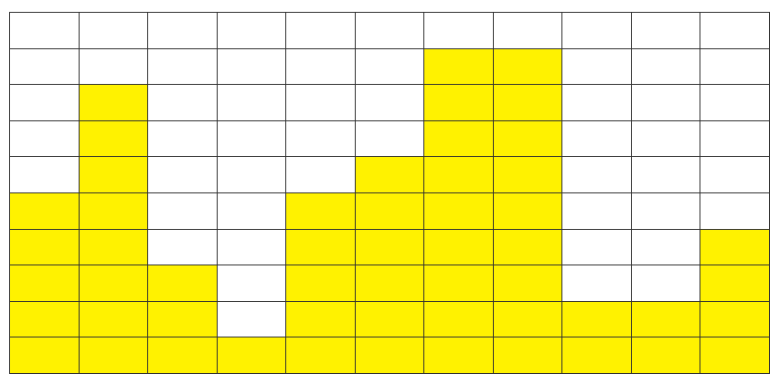
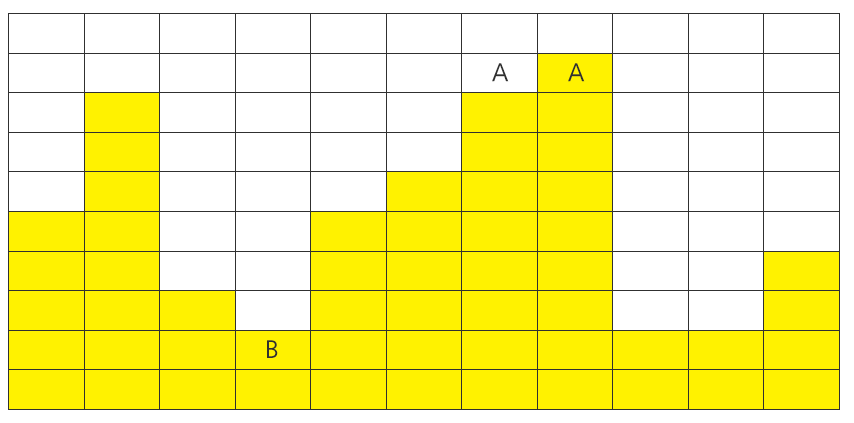
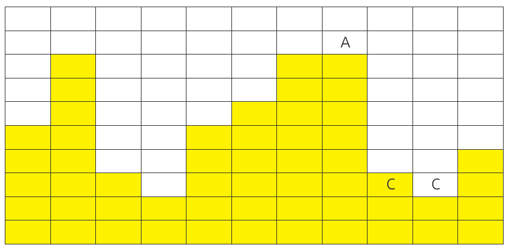
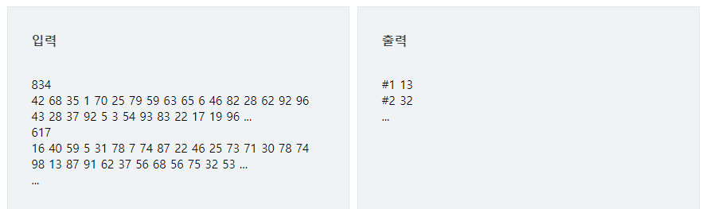

# 1208 Flatten

## 문제

한 쪽 벽면에 다음과 같이 노란색 상자들이 쌓여 있다.

높은 곳의 상자를 낮은 곳에 옮기는 방식으로 최고점과 최저점의 간격을 줄이는 작업을 평탄화라고 한다.

평탄화를 모두 수행하고 나면, 가장 높은 곳과 가장 낮은 곳의 차이가 최대 1 이내가 된다.

평탄화 작업을 위해서 상자를 옮기는 작업 횟수에 제한이 걸려있을 때, 제한된 횟수만큼 옮기는 작업을 한 후 최고점과 최저점의 차이를 반환하는 프로그램을 작성하시오.



가장 높은 곳에 있는 상자를 가장 낮은 곳으로 옮기는 작업을 덤프라고 정의한다.

위의 예시에서 제1회 덤프를 수행한 이후 화면은 다음과 같다.



A부분의 상자를 가장 낮은 B부분에 덤프하였으며, A대신 A’부분의 상자를 사용해도 무방하다.

다음은 제2회 덤프를 수행한 이후의 화면이다.



A’부분의 상자를 옮겨서, C부분에 덤프하였다. 이때 C 대신 C’부분에 덤프해도 무방하다.

2회의 덤프 후, 최고점과 최저점의 차이는 8 – 2 = 6 이 되었다 (최초덤프 이전에는 9 – 1 = 8 이었다).

덤프 횟수가 2회로 제한된다면, 이 예시 문제의 정답은 6이 된다.

## 제약사항

가로 길이는 항상 100으로 주어진다.

모든 위치에서 상자의 높이는 1이상 100이하로 주어진다.

덤프 횟수는 1이상 1000이하로 주어진다.

주어진 덤프 횟수 이내에 평탄화가 완료되면 더 이상 덤프를 수행할 수 없으므로 그 때의 최고점과 최저점의 높이 차를 반환한다 (주어진 data에 따라 0 또는 1이 된다).

## 입력

총 10개의 테스트 케이스가 주어지며, 각 테스트 케이스의 첫 번째 줄에는 덤프 횟수가 주어진다. 그리고 다음 줄에 각 상자의 높이값이 주어진다.

## 출력

\#부호와 함께 테스트 케이스의 번호를 출력하고, 공백 문자 후 테스트 케이스의 최고점과 최저점의 높이 차를 출력한다.



---

### 내가 이해한 Flatten 정리

1. 최대값을 가진 곳에서 최소값을 가진 곳에 1을 준다. 즉 최대값에는 -1 최소값에는 +1이 된다.
1. 값이 같은 경우도 있기때문에 한개씩 계속 찾아가면서 최대값과 최소값을 변경해야한다.

---

## 코드

```python
T = 10

for tc in range(1,T+1):
    N = int(input())
    arr = list(map(int,input().split()))
    
    #최대값을 가진 곳을 찾아서 -1 , 최소값을 가진 곳을 찾아서 +1 주어진 N번만큼 실행
    for i in range(N):
        minV , min_idx = arr[0] , 0
        maxV , max_idx = arr[0] , 0
        
        #가로의 길이는 항상 100 , 그 중 최대값과 최소값을 찾음
        for j in range(100):
            if minV > arr[j]:
                minV = arr[j]
                min_idx = j
            elif maxV < arr[j]:
                maxV = arr[j]
                max_idx = j
                
        #찾은 인덱스 번호로 원래 배열에서 값을 변경해줌
        arr[min_idx] += 1
        arr[max_idx] -= 1
        
    minV2 , maxV2 = arr[0] , arr[0]
    #평탄화를 마친 배열들중 최대값과 최소값을 찾아서 원하는 결과를 보여줌
    for k in range(100):
        if minV2 > arr[k]:
            minV2 = arr[k]
        elif maxV2 < arr[k]:
            maxV2 = arr[k]
    print(f'#{tc} {maxV2 - minV2}')
```

