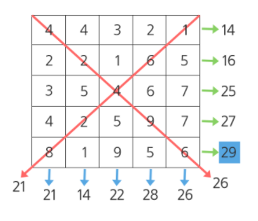
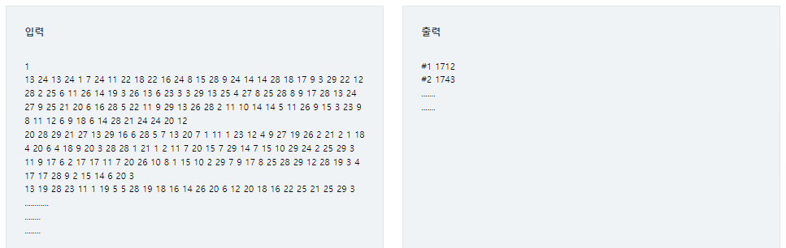

# Sum

## 문제

다음 100X100의 2차원 배열이 주어질 때, 각 행의 합, 각 열의 합, 각 대각선의 합 중 최댓값을 구하는 프로그램을 작성하여라.

다음과 같은 5X5 배열에서 최댓값은 29이다.



## 제약사항

총 10개의 테스트 케이스가 주어진다.

배열의 크기는 100X100으로 동일하다.

각 행의 합은 integer 범위를 넘어가지 않는다.

동일한 최댓값이 있을 경우, 하나의 값만 출력한다.

## 입력

각 테스트 케이스의 첫 줄에는 테스트 케이스 번호가 주어지고 그 다음 줄부터는 2차원 배열의 각 행 값이 주어진다.

## 출력

\#부호와 함께 테스트 케이스의 번호를 출력하고, 공백 문자 후 테스트 케이스의 답을 출력한다.



---

### 내가 이해한 Sum 정리

1. 각행과 열 그리고 대각선의 합을 구한다.
   - 여기서 합을 새로운 리스트를 생성해 값을 추가하면 그다지 효율적이지 못하다.
2. 행 : `arr[i][j]` 
3. 열 : `arr[j][i]` 
4. 대각선 : `arr[i][i]` & `arr[i][-i-1]`

---

## 코드

```python
T = 10

for tc in range(1,T+1):
    N = int(input())
    arr = [list(map(int,input().split())) for _ in range(100)]

    # 최대값
    maxV = 0
    # 대각선의 합
    dae1_sum = 0
    dae2_sum = 0
    
    
    for i in range(100):
        # 각 행과 열의 합
        row_sum = 0
        col_sum = 0
        for j in range(100):
            row_sum += arr[i][j]
            col_sum += arr[j][i]
            # 행의 합과 열의 합을 비교하고 maxV보다 클 때 값을 해당 값으로 변경한다. 
            if col_sum < row_sum and maxV < row_sum:
                maxV = row_sum
            elif row_sum < col_sum and maxV < col_sum:
                maxV = col_sum
        # 대각선의 합 구하기
        dae1_sum += arr[i][i]
        dae2_sum += arr[i][-i-1]
        
    # 대각선의 합을 비교하고 maxV보다 클 때 해당 값으로 변경한다.
    if dae1_sum < dae2_sum and maxV < dae2_sum:
        maxV = dae2_sum
    elif dae2_sum < dae1_sum and maxV < dae1_sum:
        maxV = dae1_sum

    print(f'#{tc} {maxV}')
```

