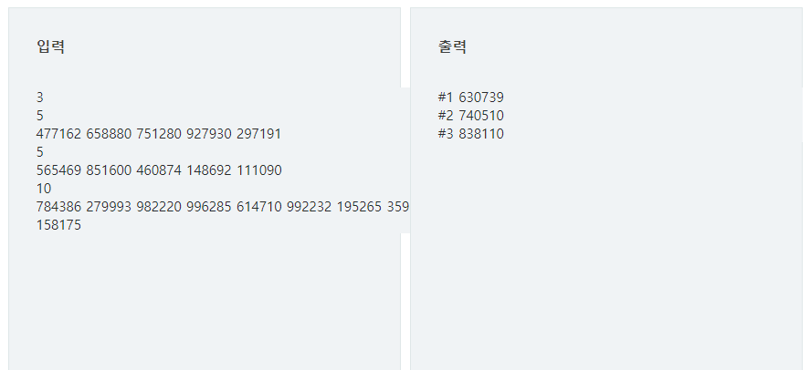

# 13623 min max

## 문제

N개의 양의 정수에서 가장 큰 수와 가장 작은 수의 차이를 출력하시오.

## 입력

첫 줄에 테스트 케이스의 수 T가 주어진다. ( 1 ≤ T ≤ 50 )

각 케이스의 첫 줄에 양수의 개수 N이 주어진다. ( 5 ≤ N ≤ 1000 )

다음 줄에 N개의 양수 ai가 주어진다. ( 1 ≤ ai≤ 1000000 )

## 출력

각 줄마다 "#T" (T는 테스트 케이스 번호)를 출력한 뒤, 답을 출력한다.



---

### 내가 이해한 min max 정리

1. 값을 하나하나 비교해서 minV,maxV를 찾는다

---

## 코드

```python
T = int(input())

for tc in range(1,T+1):
    N = int(input())
    arr = list(map(int,input().split()))
    minV = arr[0]
    maxV = arr[0]
    for i in range(len(arr)):
        if maxV < arr[i]:
            maxV = arr[i]
        elif minV > arr[i]:
            minV = arr[i]
    print(f'#{tc} {maxV-minV}')
```

