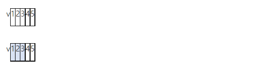
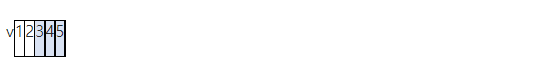
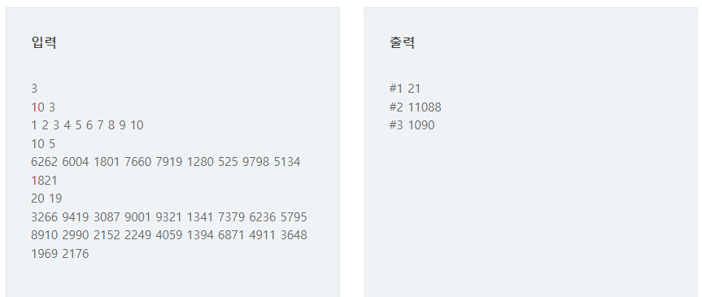

# 13626 구간합

## 문제

N개의 정수가 들어있는 배열에서 이웃한 M개의 합을 계산하는 것은 디지털 필터링의 기초연산이다.

M개의 합이 가장 큰 경우와 가장 작은 경우의 차이를 출력하는 프로그램을 작성하시오.

다음은 N=5, M=3이고 5개의 숫자 1 2 3 4 5가 배열 v에 들어있는 경우이다.



이웃한 M개의 합이 가장 작은 경우 1 + 2 + 3 = 6



이웃한 M개의 합이 가장 큰 경우 3 + 4 + 5 = 12

답은 12와 6의 차인 6을 출력한다.

## 입력

첫 줄에 테스트 케이스 개수 T가 주어진다. ( 1 ≤ T ≤ 50 )


다음 줄부터 테스트케이스의 첫 줄에 정수의 개수 N과 구간의 개수 M 주어진다. ( 10 ≤ N ≤ 100, 2 ≤ M ＜ N )


다음 줄에 N개의 정수 ai가 주어진다. ( 1 ≤ a ≤ 10000 )

## 출력

각 줄마다 "#T" (T는 테스트 케이스 번호)를 출력한 뒤, 답을 출력한다.



---

### 내가 이해한 구간합 정리

1. 버블정렬처럼 범위의 시작이 한칸씩 이동하는 코드를 사용해야한다.

---

## 코드

```python
T = int(input())

for tc in range(1,T+1):
    N , M = map(int,input().split())
    arr = list(map(int,input().split()))
    # N개의 정수를 M개씩 더하기
    sum_arr = []
    for i in range(N-M+1):
        sumV = 0
        for j in range(i,i+M):
            sumV += arr[j]
        sum_arr.append(sumV)
    #최대값과 최소값의 차이 구하기
    minV = sum_arr[0]
    maxV = sum_arr[0]
    for k in range(len(sum_arr)):
        if minV > sum_arr[k]:
            minV = sum_arr[k]
        elif maxV < sum_arr[k]:
            maxV = sum_arr[k]
    # 출력
    print(f'#{tc} {maxV-minV}')
```

