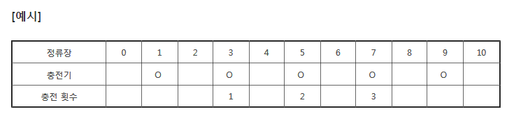
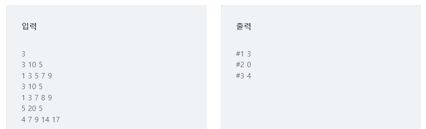

# 13627 전기버스

## 문제

A도시는 전기버스를 운행하려고 한다. 전기버스는 한번 충전으로 이동할 수 있는 정류장 수가 정해져 있어서, 중간에 충전기가 설치된 정류장을 만들기로 했다.

버스는 0번에서 출발해 종점인 N번 정류장까지 이동하고, 한번 충전으로 최대한 이동할 수 있는 정류장 수 K가 정해져 있다.

충전기가 설치된 M개의 정류장 번호가 주어질 때, 최소한 몇 번의 충전을 해야 종점에 도착할 수 있는지 출력하는 프로그램을 만드시오.

만약 충전기 설치가 잘못되어 종점에 도착할 수 없는 경우는 0을 출력한다. 출발지에는 항상 충전기가 설치되어 있지만 충전횟수에는 포함하지 않는다.



다음은 K = 3, N = 10, M = 5, 충전기가 설치된 정류장이 1, 3, 5, 7, 9인 경우의 예이다.

## 입력

첫 줄에 노선 수 T가 주어진다. ( 1 ≤ T ≤ 50 )


각 노선별로 K, N, M이 주어지고, 다음줄에 M개의 정류장 번호가 주어진다. ( 1 ≤ K, N, M ≤ 100 )

## 출력

\#과 노선번호, 빈칸에 이어 최소 충전횟수 또는 0을 출력한다.



---

### 내가 이해한 전기버스 정리

1. 갈수있는 최대에서 그 최대거리에안에 있는 제일 먼 곳의 충전소를 찾아야한다.

---

## 코드

```python
T = int(input())

for tc in range(1,T+1):
    K , N , M = map(int,input().split())
    arr = list(map(int,input().split()))
    
    # 충전소 위치를 찾기위한 배열
    #N+1인 이유 : 0-10까지는 10개가아니라 11개이기때문이다.
    cnt_electric = [0] * (N+1) 
    
    # 충전소가 있으면 1, 아니면 0
    for i in range(len(arr)):
        cnt_electric[arr[i]] += 1
    
    stop_i = 0 # 충전하는 위치(변함)
    counts = 0 # 멈추는 횟수
    
    for a in range(N):
        #stop_i의 값이 마지막 정류장 값보다 크거나 같으면 무사히 도착!
        if stop_i + K >= N:
            break
        #뒤에서부터 한칸씩 충전소 찾기
        for j in range(stop_i + K, stop_i, -1):
            if cnt_electric[j]:
                stop_i = j
                counts += 1
                break
            else:
                pass
        else:
            counts=0
            break
    print(f'#{tc} {counts}')
```

