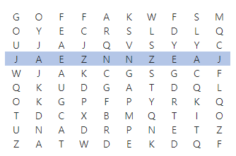

# 회문문제

## 문제

ABBA처럼 어느 방향에서 읽어도 같은 문자열을 회문이라 한다. NxN 크기의 글자판에서 길이가 M인 회문을 찾아 출력하는 프로그램을 만드시오.

회문은 1개가 존재하는데, 가로 뿐만 아니라 세로로 찾아질 수도 있다.
 

예를 들어 N=10, M=10 일 때, 다음과 같이 회문을 찾을 수 있다.



## 입력

첫 줄에 테스트 케이스 개수 T가 주어진다. 1≤T≤50

다음 줄부터 테스트케이스의 첫 줄에 N과 M이 주어진다. 10≤N≤100, 5≤M≤N

다음 줄부터 N개의 글자를 가진 N개의 줄이 주어진다.

## 출력

각 줄마다 "#T" (T는 테스트 케이스 번호)를 출력한 뒤, 답을 출력한다.

## 코드

[ **1차시도** ]

```python
T = int(input())

for tc in range(1,T+1):
    N , M = map(int,input().split())
    str_arr = [list(map(str,input())) for _ in range(N)]

    find_M = []
    for i in range(N):
        if N != M :
            for j in range(N-M+1):
                for k in range(M//2):
                    if str_arr[i][k+j] != str_arr[i][-N + M - 1+j]:
                        del (find_M[::])
                    else:
                        find_M.insert(k,str_arr[i][k+j])
                        find_M.insert(k+1,str_arr[i][k+j])
                else:
                    if not find_M:
                        for j in range(N - M + 1):
                            for k in range(M // 2):
                                if str_arr[k + j][i] != str_arr[-N + M - 1+j][i]:
                                    del (find_M[::])
                                else:
                                    find_M.insert(k, str_arr[i][k + j])
                                    find_M.insert(k + 1, str_arr[i][k + j])
        else:
            for j in range(M//2):
                if str_arr[i][j] != str_arr[i][-j-1]:
                    del(find_M[::])
                else:
                    find_M.insert(j,str_arr[i][j])
                    find_M.insert(j+1, str_arr[i][j])
            else:
                if not find_M:
                    for j in range(M // 2):
                        if str_arr[j][i] != str_arr[-j-1][i]:
                            del (find_M[::])
                        else:
                            find_M.insert(j, str_arr[j][i])
                            find_M.insert(j + 1, str_arr[j][i])
            print(find_M)
            
            
# 망한 코드임
```

[ **2차시도** ]

```python
T = int(input())

def find_m_row(n,m,list_x):
    for i in range(n):
        for j in range(n-m+1):
            find_M_row = list_x[i][j:j+m]
        if find_M_row[::] == find_M_row[::-1]:
            return find_M_row

def find_m_col(n,m,list_x):
    for i in range(n):
        for k in range(n-m+1):
            find_M_col = []
            for j in range(m):
                find_M_col.append(list_x[j+k][i])
            if find_M_col[::] == find_M_col[::-1]:
                return find_M_col


for tc in range(1,T+1):
    N , M = map(int,input().split())
    str_arr = [list(map(str,input())) for _ in range(N)]

    row_m = find_m_row(N,M,str_arr)
    col_m = find_m_col(N, M, str_arr)

    if row_m:
        print(f'#{tc} ',end='')
        for i in row_m:
            print(i,end='')
        print()
    elif col_m:
        print(f'#{tc} ',end='')
        for i in col_m:
            print(i,end='')
        print()
```

