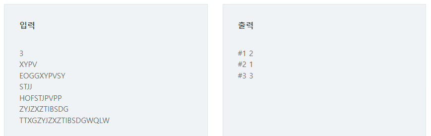

# 글자수

## 문제

두 개의 문자열 str1과 str2가 주어진다. 문자열 str1에 포함된 글자들이 str2에 몇 개씩 들어있는지 찾고, 그중 가장 많은 글자의 개수를 출력하는 프로그램을 만드시오.

예를 들어 str1 = “ABCA”, str2 = “ABABCA”인 경우, str1의 A가 str2에 3개 있으므로 가장 많은 글자가 되고 3을 출력한다.

파이썬의 경우 딕셔너리를 이용할 수 있다.

## 입력

첫 줄에 테스트 케이스 개수 T가 주어진다. 1≤T≤50

다음 줄부터 테스트 케이스 별로 길이가 N인 문자열 str1과 길이가 M인 str2가 각각 다른 줄에 주어진다. 5≤N≤100, 10≤M≤1000, N≤M

## 출력

각 줄마다 "#T" (T는 테스트 케이스 번호)를 출력한 뒤, 답을 출력한다.



## 코드

```python
T = int(input())

for tc in range(1,T+1):
    str1 = list(input())
    str2 = list(input())

    count_str = {}
    for i in range(len(str1)):
        if str1[i] not in count_str.keys():
            count_str[str1[i]] = 0

    cnt = 0
    for i in range(len(str2)):
        for j in count_str.keys():
            if str2[i] == j:
                count_str[j] = count_str[j] + 1
                break
        else:
            cnt += 1

    maxV = 0
    for i in count_str.values():
        if maxV<i:
            maxV = i
    print(f'#{tc} {maxV}')
```

