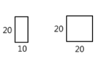
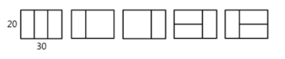

# 종이붙이기

## 문제

어린이 알고리즘 교실의 선생님은 경우의 수 놀이를 위해, 그림처럼 가로x세로 길이가 10x20, 20x20인 직사각형 종이를 잔뜩 준비했다.



그리고 교실 바닥에 20xN 크기의 직사각형을 테이프로 표시하고, 이 안에 준비한 종이를 빈틈없이 붙이는 방법을 찾아보려고 한다. N이 30인 경우 다음 그림처럼 종이를 붙일 수 있다.



10의 배수인 N이 주어졌을 때, 종이를 붙이는 모든 경우를 찾으려면 테이프로 만든 표시한 영역을 몇 개나 만들어야 되는지 계산하는 프로그램을 만드시오. 직사각형 종이가 모자라는 경우는 없다.

## 입력

첫 줄에 테스트 케이스 개수 T가 주어진다. 1≤T≤50
다음 줄부터 테스트 케이스 별로 N이 주어진다. 10≤N≤300, N은 10의 배수

## 출력

각 줄마다 "#T" (T는 테스트 케이스 번호)를 출력한 뒤, 답을 출력한다.

## 코드

```python
T = int(input())

for tc in range(1,T+1):
    # N이 1->1 / 2->3 / 3->5 / 4->11 / 5->21
    # 규칙은 (N의경우의수) = (N-1경우의수) + (N-2경의우수)*2
    N = int(input())//10
    count_arr = [0]*N
    count_arr[0] = 1
    count_arr[1] = 3

    for i in range(2,N):
        count_arr[i] = count_arr[i-1] + count_arr[i-2]*2

    print(f'#{tc} {count_arr[N-1]}')
```

