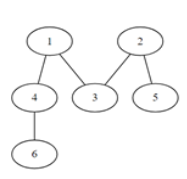

# 노드의 거리

## 문제

V개의 노드 개수와 방향성이 없는 E개의 간선 정보가 주어진다.

주어진 출발 노드에서 최소 몇 개의 간선을 지나면 도착 노드에 갈 수 있는지 알아내는 프로그램을 만드시오.

예를 들어 다음과 같은 그래프에서 1에서 6으로 가는 경우, 두 개의 간선을 지나면 되므로 2를 출력한다.



노드 번호는 1번부터 존재하며, 노드 중에는 간선으로 연결되지 않은 경우도 있을 수 있다.

## 입력

첫 줄에 테스트 케이스 개수 T가 주어진다. 1<=T<=50

다음 줄부터 테스트 케이스의 첫 줄에 V와 E가 주어진다. 5<=V=50, 4<=E<=1000

테스트케이스의 둘째 줄부터 E개의 줄에 걸쳐, 간선의 양쪽 노드 번호가 주어진다.

E개의 줄 이후에는 출발 노드 S와 도착 노드 G가 주어진다.

## 출력

각 줄마다 "#T" (T는 테스트 케이스 번호)를 출력한 뒤, 답을 출력한다.

두 노드 S와 G가 서로 연결되어 있지 않다면, 0을 출력한다.

### 내가 이해한 노드의 거리 정리

1. 이번엔 연결된 길이 있는지만 찾는게 아니라 가는 길에 몇개의 노드를 거쳐가는지 찾아야한다.
2. 예상으론 그전 코드에서 cnt만 해주면 될거 같긴하다.
3. 방향성이 없다!!!!!! 난감한걸?

```text
7 4
1 6
2 3
2 6
3 5
1 5 
[[X],[6],[3,6],[2,5],[],[3],[1,2]]
[0,1,0,0,0,0,1]
1 -> 6 -> 2 -> 3 -> 5 : 4
```


## 코드

```python
# 입력순서 : T(테스트케이스 수) -> V(노드 수) , E(간선 수) -> S(출발 노드) , G(도착 노드)

T = int(input())

# dfs 함수
def dfs(node,d):
    global result
    # 백트레킹
    if d >= result:
        return
    # 함수 탈출
    if node == G:
        result = min(result,d)
        return
    # 재귀함수
    for n in node_arr[node]:
        if not visited[n]:
            visited[n] = 1
            dfs(n,d+1)
            visited[n] = 0

for tc in range(1,T+1):
    V,E = map(int,input().split())

    # 간선들을 담을 리스트
    node_arr = [[] for _ in range(V+1) ]

    # 간선 업로드
    for i in range(E):
        n_1 , n_2 = map(int,input().split())
        node_arr[n_1].append(n_2)
        node_arr[n_2].append(n_1)

    # 방문기록 리스트
    visited = [0] * (V+1)

    S , G = map(int,input().split())

    visited[S] = 1

    result = 1e9

    dfs(S,0)

    print(f'#{tc} {result}')
```

