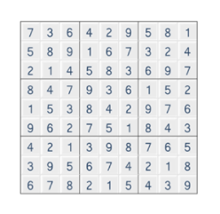
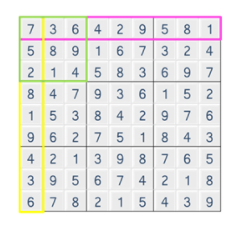

# 스도쿠검증

## 문제

스도쿠는 숫자퍼즐로, **가로 9칸 세로 9칸**으로 이루어져 있는 표에 **1 부터 9 까지의 숫자**를 채워넣는 퍼즐이다.



같은 줄에 **1 에서 9 까지의 숫자를 한번씩만 넣고, 3 x 3 크기의 작은 격자 또한, 1 에서 9 까지의 숫자가 겹치지 않아야 한다.**



입력으로 9 X 9 크기의 스도쿠 퍼즐의 숫자들이 주어졌을 때, 위와 같이 겹치는 숫자가 없을 경우, 1을 정답으로 출력하고 그렇지 않을 경우 0 을 출력한다

## 제약사항

1. 퍼즐은 모두 숫자로 채워진 상태로 주어진다.

2. 입력으로 주어지는 퍼즐의 모든 숫자는 1 이상 9 이하의 정수이다.

## 입력

입력은 첫 줄에 총 테스트 케이스의 개수 T가 온다.

다음 줄부터 각 테스트 케이스가 주어진다.

테스트 케이스는 9 x 9 크기의 퍼즐의 데이터이다.

## 출력

테스트 케이스 t에 대한 결과는 “#t”을 찍고, 한 칸 띄고, 정답을 출력한다.

(t는 테스트 케이스의 번호를 의미하며 1부터 시작한다.)

---

### 내가 이해한 스도쿠검증 정리

1. 가로에서도 1-9 세로도 1-9 3*3 박스안에도 1-9까지의 숫자가 하나씩 들어가야한다.
2. 모든 경우들이 각각 총합이 45이면 성공적인 스도쿠이고 45가 아닌 다른 값이 있으면 실패한 검증이다.

## 코드

```python
T = int(input())

for tc in range(1,T+1):
    # 스도쿠판 가져오기
    arr = [list(map(int,input().split())) for _ in range(9)]

    # 정답
    result = 1

    # 가로로 검사하는 줄의 합이 45면 검증성공
    cnt_row = 0
    # 가로로 검사
    for i in range(9):
        for j in range(9):
            cnt_row += arr[i][j]
        if cnt_row != 45:
            result = 0
            break
        else:
            cnt_row = 0

    # 세로로 검사하는 줄의 합이 45면 검증성공
    cnt_col = 0
    # 세로로 검사
    for i in range(9):
        for j in range(9):
            cnt_col += arr[j][i]
        if cnt_col != 45:
            result = 0
            break
        else:
            cnt_col= 0

    # 3*3 검사 합이 45명 검증성공
    cnt_box = 0
    # 3*3 검사
    for i in range(0,9,3):
        for j in range(0,9,3):
            for k in range(3):
                cnt_box += sum(arr[i+k][j:j+3])
            if cnt_box != 45:
                result =0
                break
            else:
                cnt_box = 0

    # 출력
    print(f'#{tc} {result}')
```

