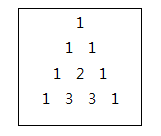

# 파스칼의 삼각형

## 문제

크기가 N인 파스칼의 삼각형을 만들어야 한다.

파스칼의 삼각형이란 아래와 같은 규칙을 따른다.

1. 첫 번째 줄은 항상 숫자 1이다.

2. 두 번째 줄부터 각 숫자들은 자신의 왼쪽과 오른쪽 위의 숫자의 합으로 구성된다.

N이 4일 경우,



N을 입력 받아 크기 N인 파스칼의 삼각형을 출력하는 프로그램을 작성하시오.

## 제약 사항

파스칼의 삼각형의 크기 N은 1 이상 10 이하의 정수이다. (1 ≤ N ≤ 10)

## 입력

가장 첫 줄에는 테스트 케이스의 개수 T가 주어지고, 그 아래로 각 테스트 케이스가 주어진다.

각 테스트 케이스에는 N이 주어진다.

## 출력

각 줄은 '#t'로 시작하고, 다음 줄부터 파스칼의 삼각형을 출력한다.

삼각형 각 줄의 처음 숫자가 나오기 전까지의 빈 칸은 생략하고 숫자들 사이에는 한 칸의 빈칸을 출력한다.

(t는 테스트 케이스의 번호를 의미하며 1부터 시작한다.)

### 내가 이해한 파스칼의 삼각형 정리

1. 시작은 항상 1이다
2. 양 끝값도 항상 1이다.
3. 행의 번호보다 작은 열에서만 연산이 이뤄진다.

## 코드

```python
# testcase 수 
T = int(input())

for tc in range(1,T+1):
    # 파스칼의 삼각형 줄 수
    N = int(input())
    # 2차배열을 만드는데, 한줄에 그전줄보다 한개씩 늘어나게 한다.
    arr = []
    for i in range(1,N+1):
        arr.append([0]*i)
    
    # 처음 값은 항상 1이기때문에 넣어준다.
    arr[0][0] = 1
    
    # 첫줄은 제외하고 그 이후 줄부터 실행하는데,
    # i : 행의 번호
    for i in range(1,N):
        # j : 열의 번호
        for j in range(i+1):
            # 열번호가 행번호보다 작고 0보다 큰 경우에만 수행되도록한다.
            if 0 < j < i :
                arr[i][j] = arr[i-1][j-1] + arr[i-1][j]
            # 열번호가 0일때
            elif not j:
                arr[i][j] = arr[i-1][j]
            # 열번호가 마지막 번호일때
            else:
                arr[i][j] = arr[i-1][j-1]

    print(f'#{tc}')
    for i in arr:
        print(*i)
```

