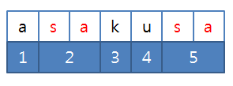

# 가장 빠른 문자열 타이핑

## 문제

어떤 문자열 A를 타이핑하려고 한다.

그냥 한 글자씩 타이핑 한다면 A의 길이만큼 키를 눌러야 할 것이다.

여기에 속도를 조금 더 높이기 위해 어떤 문자열 B가 저장되어 있어서 키를 한번 누른 것으로 B전체를 타이핑 할 수 있다.

이미 타이핑 한 문자를 지우는 것은 불가능하다.

예를 들어 A=”asakusa”, B=”sa”일 때, 다음 그림과 같이 B를 두 번 사용하면 5번 만에 A를 타이핑 할 수 있다.



A와 B가 주어질 때 A 전체를 타이핑 하기 위해 키를 눌러야 하는 횟수의 최솟값을 구하여라.

## 입력

첫 번째 줄에 테스트 케이스의 수 T가 주어진다.

각 테스트 케이스마다 첫 번째 줄에 두 문자열 A, B가 주어진다. A의 길이는 1이상 10,000이하, B의 길이는 1이상 100이하이다.

## 출력

각 테스트 케이스마다 A 전체를 타이핑 하기 위해 키를 눌러야 하는 횟수의 최솟값을 출력한다.

## 코드

```python
T = int(input())

for tc in range(1,T+1):
    A , B = map(str,input().split())

    cnt = 0
    start_n = 0
    typing = ''
    for i in range(len(A)):
        if typing != A :
            if A[start_n:start_n+len(B)] != B:
                typing += A[start_n]
                start_n += 1
                cnt += 1
            else:
                typing += B
                start_n += len(B)
                cnt += 1
        else:
            break
    print(f'#{tc} {cnt}')
```

