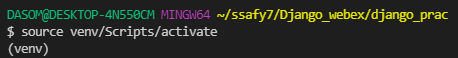
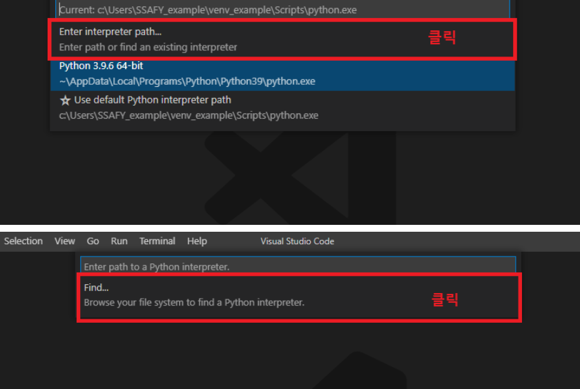
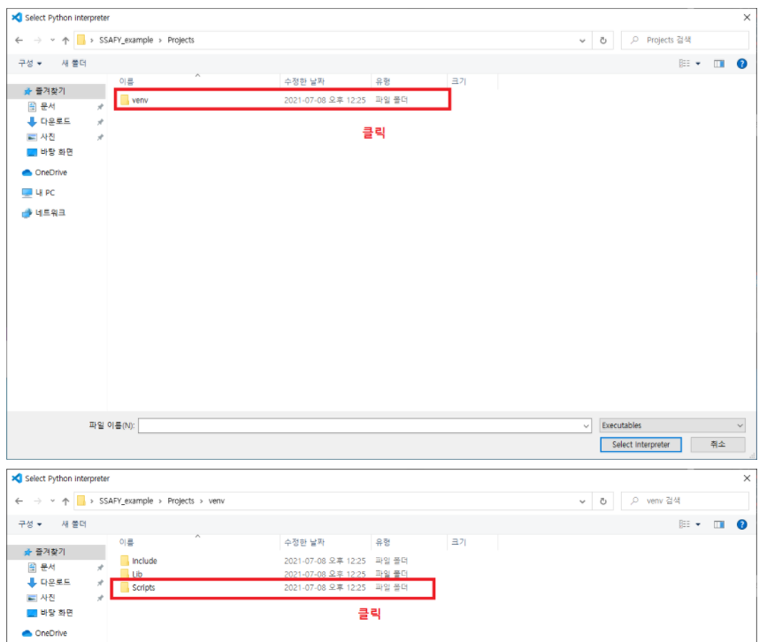
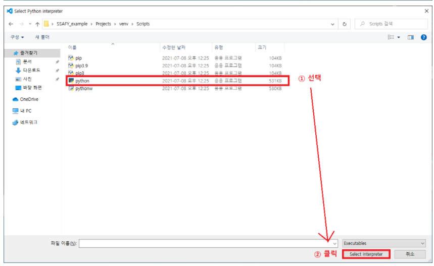
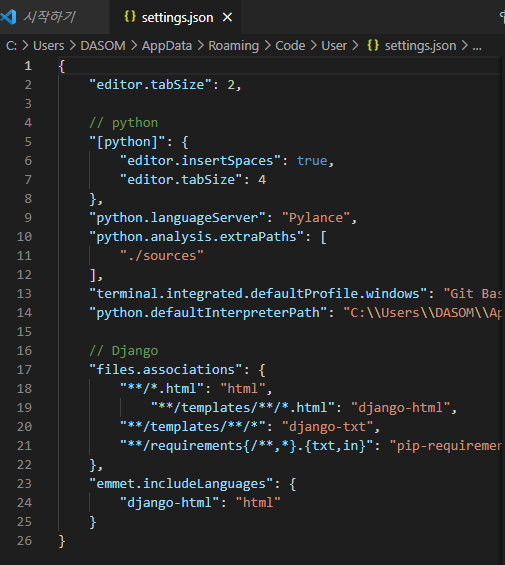

# Django 설정

## 1. 파이썬 가상환경 설정

1. 파이썬 venv모듈 다운로드

   ```bash
   python -m venv {파일이름}
   ```

2. venv 모듈 활성화

   ```bash
   source {파일이름}/Scripts/activate
   ```

3. 파이썬 Interpretor 설정 (vscode)

   `vscode`에서 열기 -> `ctrl+shifr+p` -> `Python: Select Interpretor` 검색 -> Python 3.9.6에서 자신의 파일이름이 있는 것 선택

   

   위 사진과 같이 가상환경이 자동으로 활성화 된 터미널인지 확인

### * 가상환경이 출력되지 않는 경우

1. `ctrl+shift+p`
2. 
3. 
4. 

## 2. Django 설치 전 준비사항

1. vscode에서 django와 extension 설치

2. vscode에서 django extension 설정

   `ctrl+shift+p` -> `json`검색 -> `Preferences: Open Settings (JSON)` 선택

3. 설정코드작성

   ```json
   // Django
     "files.associations": {
       "**/*.html": "html",
   	    "**/templates/**/*.html": "django-html",
       "**/templates/**/*": "django-txt",
       "**/requirements{/**,*}.{txt,in}": "pip-requirements"
     },
     "emmet.includeLanguages": {
       "django-html": "html"
     }
   ```

   

## 3. Django 설치

1. Django 설치

   ```bash
   pip install django==3.2.12
   ```

2. 프로젝트 생성

   ```bash
   django-admin startproject {프로젝트명} .
   ```

3. Django 서버 시작(활성화)

   ```bash
   python manage.py runserver
   ```

## 4. Application 생성

1. app 생성

   ```bash
   python manage.py startapp {app명}
   ```

## 5. 생성한 앱 등록

1. `settings.py`에서 `INSTALLED_APPS`에 생성한 app명을 '`app명`,' 로 추가해준다

**앱 생성 시 **